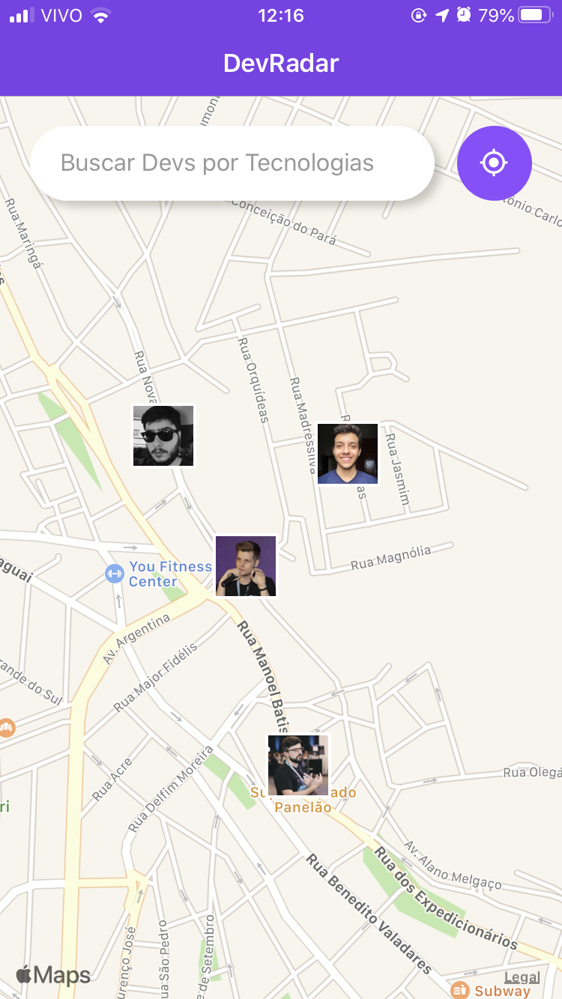
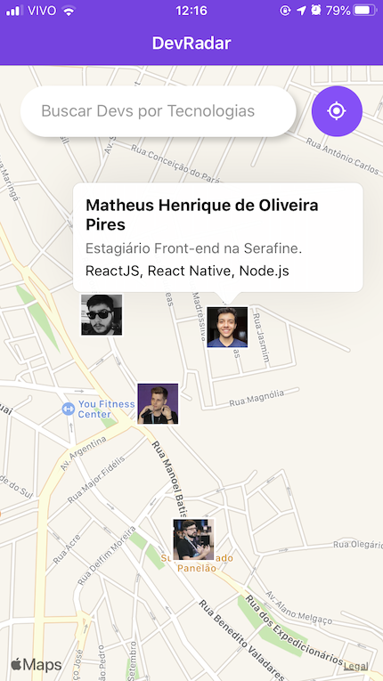
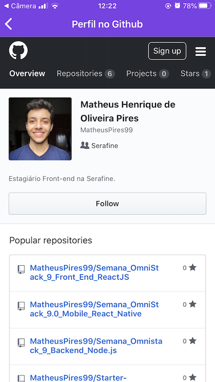

# ReactJS, React Native, Node.js e MongoDB
# Semana OmniStack 10.0
Nessa semana OmniStack foi desenvolvida da aplicação DevRadar, utilizando ReactJS no Front-end Web, React Native no Front-end mobile e Node.js com MongoDB no Backend.

# ReactJS 

# React Native

